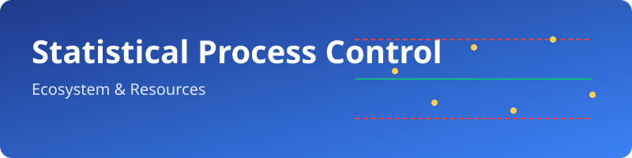

# 📊 Awesome-Statistical-Process-Control

> 🎯 A curated directory of top **Statistical Process Control (SPC)** SaaS Products & Open-Source GitHub Projects.

  

*Focused on Control Charts, Real-Time Process Monitoring, Capability Analysis, Out-of-Control Detection & Quality Improvement*

**Last updated: August 2026**

This repository tracks notable ☁️ **SaaS platforms** and 🛠️ **open-source projects** for **Statistical Process Control (SPC)**. These tools collect process data, generate control charts (X̄-R, X̄-S, I-MR, p, np, c, u, CUSUM, EWMA, etc.), detect special-cause variation, calculate process capability (Cp/Cpk, Pp/Ppk), and support real-time shop-floor monitoring and continuous improvement.

**Open-source emphasis**: This section is heavily expanded with every major active project for control-chart libraries, Python/R SPC packages, Power BI visuals, and self-hosted quality analytics — ideal for quality engineers, Six Sigma practitioners, data scientists, and manufacturers seeking transparent, programmable process control.

Contributions welcome! Open a PR to add/update entries. Keep descriptions factual and link to official sites.

## 📋 Table of Contents
- [☁️ SaaS/Hosted Platforms](#️-saashosted-platforms)
- [🛠️ Open-Source GitHub Projects](#️-open-source-github-projects)
- [🤝 How to Contribute](#-how-to-contribute)
- [⚠️ Disclaimer](#️-disclaimer)

## ☁️ SaaS/Hosted Platforms

| Product Name | Description | Company Size (Valuation) | Pricing | Free Tier Limit |
| --- | --- | --- | --- | --- |
| **[Q-DAS (Hexagon)](https://www.q-das.com/)** | Industry-standard statistical evaluation and process capability suite (qs-STAT, Procella) heavily adopted in automotive and precision manufacturing. | ~$20B (Hexagon Market Cap) | ~$10,000+ (Estimated starting cost for enterprise deployment) | 3-month trial license available for specific modules (limited to 1 installation). |
| **[Minitab Connect / Minitab Real-Time SPC / Minitab Workspace](https://www.minitab.com/)** | Minitab’s ecosystem for statistical analysis, real-time SPC monitoring, process improvement projects, and guided analytics. | ~$1B+ (Estimated Valuation) | ~$1,330 - $1,481/user/year (Starting price) | 14-day free trial. |
| **[InfinityQS / ProFicient / Enact](https://www.infinityqs.com/)** | Enterprise-grade real-time SPC and quality management platform widely used for multi-plant monitoring, automated data collection, control charts, and corrective-action workflows. | ~$100M+ (Estimated Valuation) | ~$50 - $65/user/month (estimated starting price) | No free tier; personalized evaluation environment provided upon request. |
| **[SoftExpert SPC](https://www.softexpert.com/)** | SPC module within SoftExpert’s broader quality and compliance platform. | ~$50M+ (Estimated Revenue) | ~$1,000+ (Estimated starting price for modular deployment) | No free tier; personalized product demos available upon request. |
| **[Capture3D / related metrology SPC](https://www.capture3d.com/)** | Solutions that combine 3D measurement data with process control and quality analytics. | Acquired by ZEISS | ~$5,000+ (Estimated starting cost for metrology hardware/software bundle) | No free tier; evaluation licenses provided individually by sales. |
| **[WinSPC](https://www.winspc.com/)** | Real-time statistical process control software for the shop floor, with strong integration to measurement devices, MES, and ERP systems. | ~$20M+ (Estimated Revenue) | ~$1,600 (One-time license starting price) | Fully functional free trial on request (duration negotiated, typically 14-30 days). |
| **[SQCpack](https://www.pqsystems.com/)** | Classic SPC software from PQ Systems for control charting, capability studies, and quality reporting. | ~$15M+ (Estimated Revenue) | $1,590 (Starting one-time license) | 14-day or 300-use free trial (fully functional). |
| **[DataLyzer](https://www.datalyzer.com/)** | Qualis SPC and related tools for highly regulated industries, offering control charts, MSA, and quality data management. | ~$10M+ (Estimated Revenue) | ~$1,295 (Starting one-time license per module) | No free tier; free personalized demos provided using your own data. |
| **[Datarly](https://www.datarly.com/)** | Modern SPC and quality analytics solution focused on real-time process visibility and data-driven decision making. | Startup / Seed | $1,499 (Starter Plan) | 7-day free trial for qualified clients. |
| **[InspectPoint SPC / Quality Window](https://)** | Specialized or regional SPC and inspection tools focused on practical shop-floor quality control. | ~$2M - $5M (Estimated) | ~$129/user/month (InspectPoint starting tier estimate) | InspectPoint: No trial (demo only). Quality Window: Free trial via portal (duration provided upon approval). |
| **[SPC XL](https://www.sigmazone.com/)** | Excel-based SPC add-in popular for quick control charting, capability analysis, and training environments. | Small Business | ~$299 (Estimated perpetual license) | 10-day fully functional free trial. |

## 🛠️ Open-Source GitHub Projects

- **[PySpc](https://github.com/carlosqsilva/pyspc)**   
  Popular Python library for creating a wide range of Statistical Process Control charts (variables, attributes, multivariate, EWMA, CUSUM) with a simple, human-friendly API.

- **[PowerBI-SPC](https://github.com/AUS-DOH-Safety-and-Quality/PowerBI-SPC)**   
  Free and open-source Power BI custom visual for SPC charts (run charts, I-MR, p, u, c, x̄, etc.) with no external R/Python dependencies.

- **[qcc (R package)](https://github.com/luca-scr/qcc)**   
  Mature R package for Quality Control Charts — Shewhart, CUSUM, EWMA, multivariate charts, process capability, Pareto, and cause-and-effect diagrams.

- **[spcchart / bwghughes/spc](https://github.com/bwghughes/spc)**   
  Process Control charts library focused on simplicity, with SVG and interactive Plotly output options.

- **[statprocon](https://github.com/mattmccormick/statprocon)**   
  Lightweight Python helper library for generating Process Behaviour Charts (XmR / individuals and moving range) data and limits.

- **[sixsigmaspc](https://github.com/jjmartegarcia/sixsigmaspc)**   
  Python library implementing core Six Sigma Statistical Process Control functionality.

- **[qualityTools](https://github.com/cran/qualityTools)**   
  R package for Quality Control and Statistical Process Control.

- **[pyshewhart](https://github.com/magoor/pyshewhart)**   
  Easy-to-use Python module for Shewhart control charts (X̄-R, X̄-S, CUSUM, p-charts) with Western Electric rule detection.

- **[pyqcc](https://github.com/mdy-us/pyqcc)**   
  Python port of the popular R qcc package for Statistical Quality Control.

- **[Statistical-Process-Control templates & notebooks](https://github.com/)**  
  Community collections of Python notebooks implementing X, mR, X̄-R, X̄-S, p, np, c, and u charts with Matplotlib.

- **[Databricks / enterprise SPC apps](https://github.com/)**  
  Open examples of real-time SPC charting, capability analysis, and rule detection built on modern data platforms.

- **[Additional Python SPC utilities](https://github.com/)**  
  Smaller libraries and scripts for control limits, Nelson/WECO rules, capability indices, and multivariate T² charts.

### 🌟 Additional Strong Open-Source Options
- R packages beyond qcc (qicharts2, ggQC, and related tidyverse-friendly charting tools).
- Jupyter/Streamlit dashboards that wrap the above libraries for interactive shop-floor or engineering use.
- Integration patterns that pull data from PLCs, historians, or MES into open SPC pipelines.
- Custom Western Electric / Nelson rule engines implemented in pure Python or SQL.
- Open metrology and MSA (Gage R&R) scripts that complement SPC programs.

**Frameworks for building custom systems**: Collect process data into a database or data lake, compute control limits and rules with **PySpc**, **statprocon**, **pyshewhart**, or **qcc**, visualize with Matplotlib/Plotly or the Power BI SPC visual, and trigger alerts via open workflow tools. Combine with local LLMs for natural-language interpretation of out-of-control signals and suggested root-cause investigations.

## 🤝 How to Contribute
1. Fork the repo.
2. Add/edit entries in `README.md` (follow existing format).
3. Include: name, link, 1–2 sentence description, and whether it's SaaS or open-source.
4. Submit PR with a short explanation.

Star the repo if you find it useful!

## ⚠️ Disclaimer
- This is a **community-curated** list — not exhaustive and not an endorsement.
- Statistical Process Control is a rigorous methodology. Open-source libraries implement standard charts and rules but do not replace trained quality engineers, proper sampling plans, or validated measurement systems.
- When used in regulated industries (automotive, medical devices, pharma, aerospace), ensure any self-hosted solution meets applicable validation, audit-trail, and data-integrity requirements.

## 📈 Star History

---
**Made for quality engineers, Six Sigma practitioners, process engineers, and manufacturers building transparent process control systems.**
Let's make Statistical Process Control more open, programmable, and accessible.
